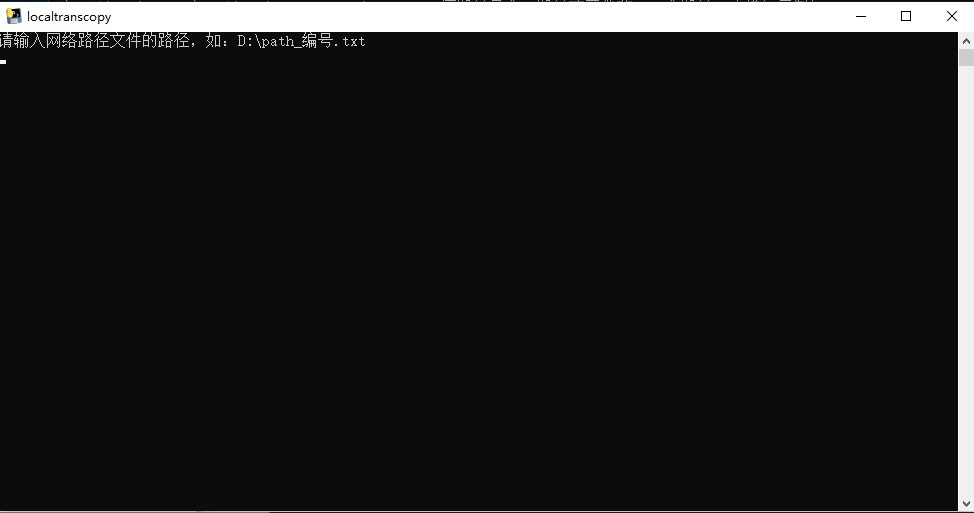
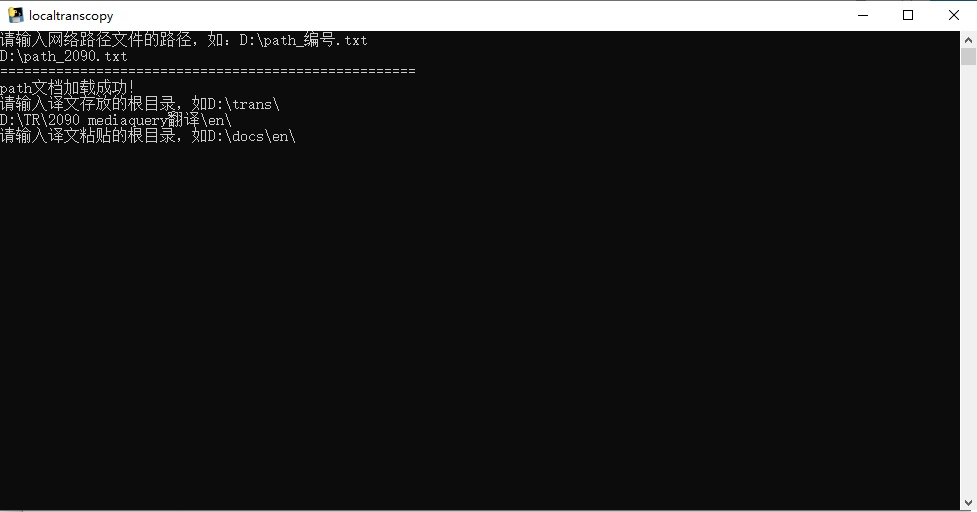
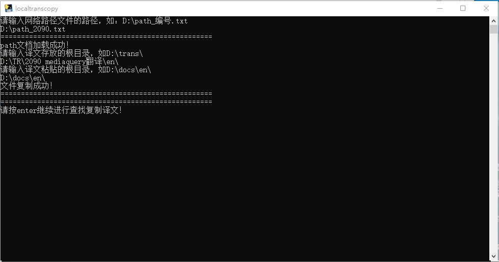
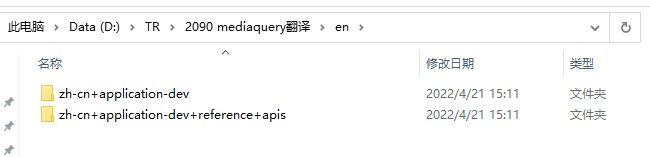

# localtranscopy

#### 介绍
通过localtranscopy，您可以快速的将翻译件复制到本地工作区(workspace)。

#### 操作步骤

1. 双击**localtranscopy.exe**，打开对应的操作界面。

2. 在白色所示的输入区域输入path文档路径，例如`D:\path_2090.txt`，再回车。

   该path文档由**websearchcopy.exe**自动生成，默认保存在D盘根目录下。

   输入完成后，工具将自动加载该path文档。

   

3. 输入译文所在的目录，且以反斜杠（\）结尾，再回车。

   假设译文在**D:\TR\2090 mediaquery翻译\en**目录下，则输入 `D:\TR\2090 mediaquery翻译\`或 `D:\TR\2090 mediaquery翻译\en\`，再回车。

   

注：译文路径下的文档名，请和**websearchcopy.exe**自动创建的文档名保持一致。如下图所示，**en**文件夹下的文档名和**websearchcopy.exe**自动创建的文档名一致。

。

4. 输入译文将要复制到的目录，以反斜杠（\）结尾，再回车。

   假设译文要存储到docs仓，默认放置在D盘根目录下，则在白色所示的输入区域输入`D:\docs\en\`，再回车。

   此时工具提示文件复制成功。译文已复制到本地工作区的对应路径，您可push到远程仓库。

   注：在进行该操作之前，请确保根目录下的文档和上游仓库一致，避免后续提交PR时出现冲突。如果需要使用分支提交PR，也需要在进行该操作之前，使用git切换到对应的分支。

#### Tips

1.  在白色输入区域，右键即可粘贴所复制的内容。
2.  通过上下方向键可以选择之前输入的命令。
