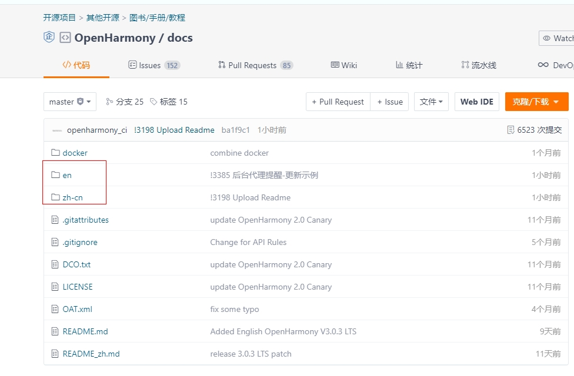
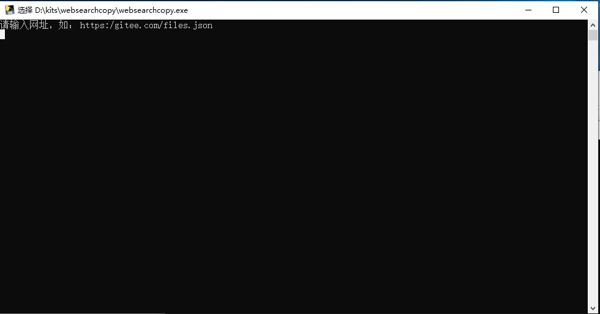
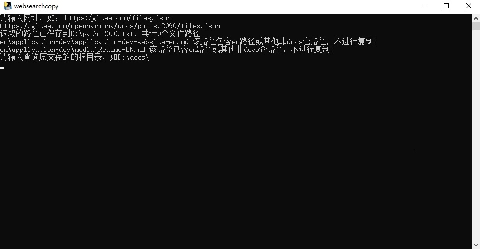
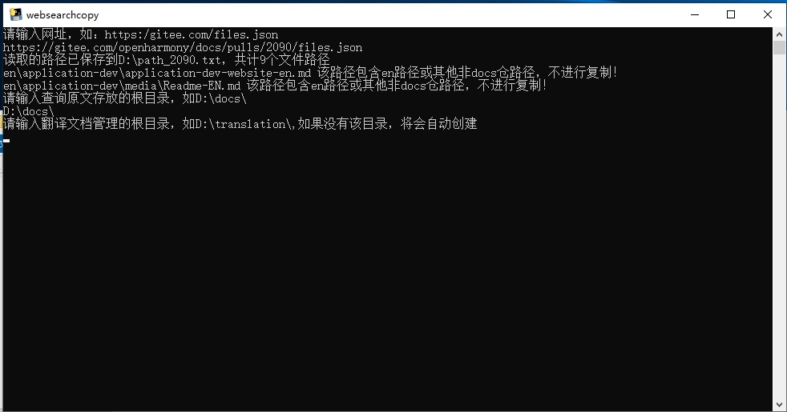
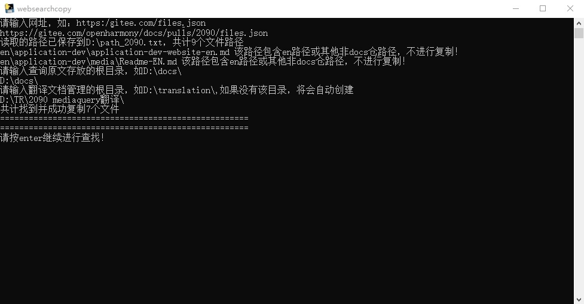
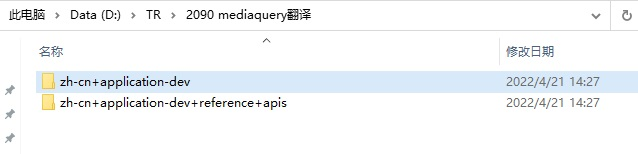

# websearchcopy (OH docs)

#### 介绍
通过websearchcopy (OH docs)，您可以快速的将PR链接中的多个文档取到指定PC目录下。本工具适用于OpenHarmony docs仓以及其他社区符合如下目录结构的其他仓：docs下直接分为zh-cn和en路径（如下截图所示）。注意：该工具默认不取en路径下的文档。

#### 操作步骤

1. 双击**dist**目录下的**websearchcopy.exe**，打开对应的操作界面。

2. 需要输入PR路径（以.json结尾），再回车。

   复制PR路径，在白色所示的输入区域右键即可粘贴所复制的路径。粘贴成功后，加上**.json**后缀，再回车即可。

   例如，对于编号为2090的PR，切换到**文件**页签，拷贝地址栏的路径https://gitee.com/openharmony/docs/pulls/2090/files，再加上**.json**后缀，即`https://gitee.com/openharmony/docs/pulls/2090/files.json`。

   
  
   工具将提示读取到的路径，包括文档数量。en路径下的文档不进行复制，因此对en路径做了特别提示。

   

3. 输入原文存在的根目录（即本地工作区），且以反斜杠（\）结尾，再回车。

   假设docs仓默认放置在D盘根目录下，则在白色所示的输入区域输入`D:\docs\`，再回车。

   在进行该操作之前，请确保根目录下的文档和上游仓库一致。
   
   

4. 输入翻译目录，以反斜杠（\）结尾，再回车。

   假设想把待翻译文件复制到**D:\TR\2090 mediaquery翻译**目录下，则输入 `D:\TR\2090 mediaquery翻译\`，再回车。

   此时工具自动提示复制成功的文档数。如果有文档未能获取到，也会有相应的提示信息。

   

   在对应的目录下，也可以看到工具取出的待翻译文件。例如：**D:\TR\2090 mediaquery翻译**目录

   

   待翻译文档已经复制到相应的路径，您可开始翻译。

#### Tips

1. 在白色输入区域，右键即可粘贴所复制的内容。

2. 通过上下方向键可以选择之前输入的命令。

#### FAQs
Q：部分待翻译件未能获取到。

A：可能原因：
    1. 分支不正确，本地工作区（workspace）无文档。
    2. 该文档在PR中是一个被删除的文档，即需要且已经从本地工作区（workspace）删除。

#### 代码贡献者

周宇
