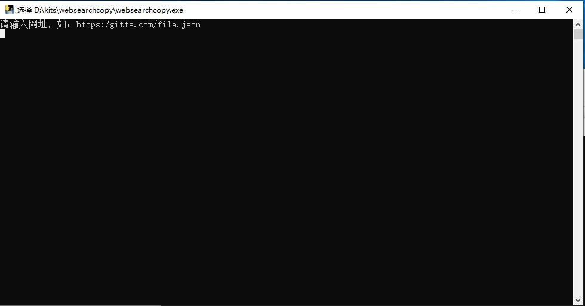
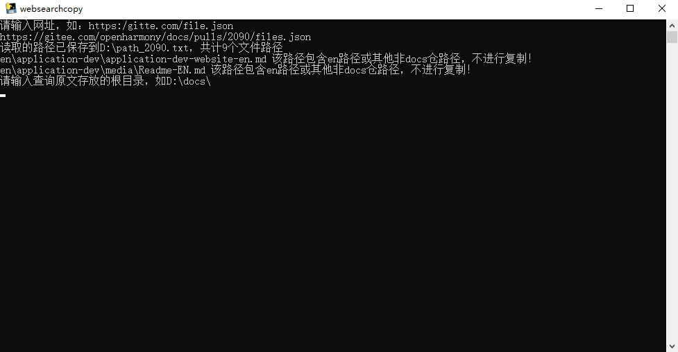
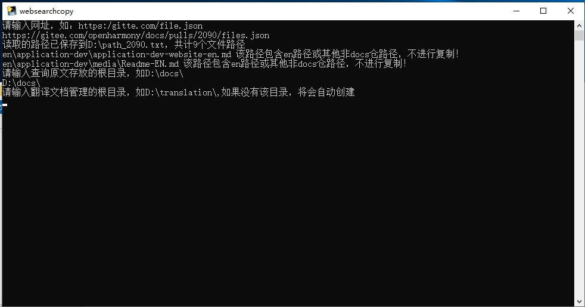
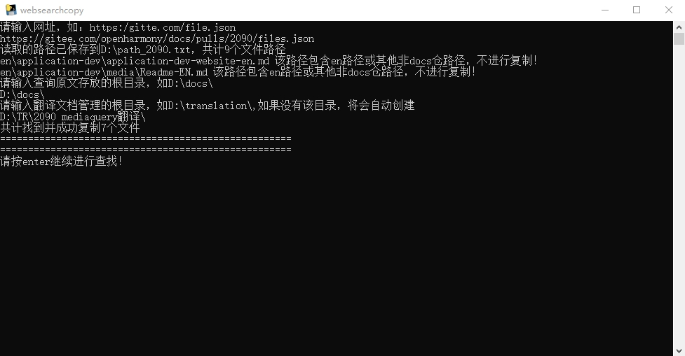
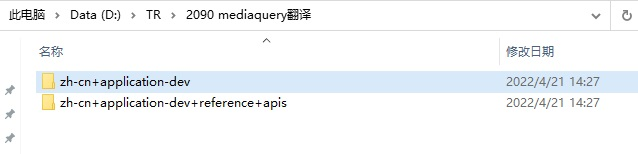

# websearchcopy

#### 介绍
通过websearchcopy，您可以快速的将PR链接中的多个文档取到指定PC目录下。

#### 操作步骤

1. 双击**websearchcopy.exe**，打开对应的操作界面。

   根据提示，第一步需要输入PR路径，且以.json结尾。

   

2. 复制PR路径，在白色所示的输入区域右键即可粘贴所复制的路径。粘贴成功后，加上**.json**后缀，再回车即可。

   例如，PR路径为https://gitee.com/openharmony/docs/pulls/2090，切换到**文件**页签，拷贝地址栏的路径，再加上**.json**后缀，即`https://gitee.com/openharmony/docs/pulls/2090/files.json`

   工具将提示读取到的路径，包括文档数量。en路径下的文档不进行复制，因此对en路径做了特别提示。

   

3. 输入原文存在的根目录，且以反斜杠（\）结尾，再回车。

   假设docs仓默认放置在D盘根目录下，则在白色所示的输入区域输入`D:\docs\`，再回车。

   在进行该操作之前，请确保根目录下的文档和上游仓库一致。

4. 输入翻译目录，以反斜杠（\）结尾，再回车。

   假设想把待翻译文件复制到**D:\TR\2090 mediaquery翻译**目录下，则输入 `D:\TR\2090 mediaquery翻译\`，再回车。

   此时工具自动提示复制成功的文档数。在对应的目录下，也可以看到工具取出的中文文档。

   

   

   **D:\TR\2090 mediaquery翻译**目录

   

   

   翻译所需的中文文档已经复制到相应的路径，您可开始翻译。

#### Tips

1.  在白色输入区域，右键即可粘贴所复制的内容。
2.  通过上下方向键可以选择之前输入的命令。
